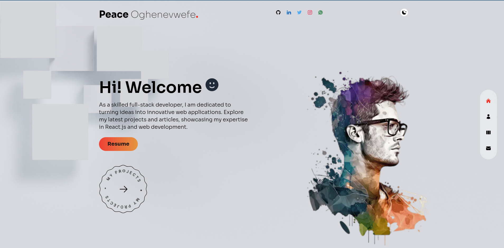

# My Portfolio

This is my portfolio, here can can learn more about me and browse some of the projects i have built in my journey so far, Send me a message there with the Lets connect form or send me an email directly to `peazzycole@gmail.com`. ENJOY!

## LIVE DEMO

<https://peazzycole.vercel.app/>

## PREVIEW

## Installation

If you want to create a similar porfolio you can follow the process below to install

1. Clone the repo and `cd` into it
2. Run `npm install` to install all required dependencies (this will create a /node_modules folder)
3. Then Run `npm run dev` to serve your project to localhost:3000
4. Enjoy
